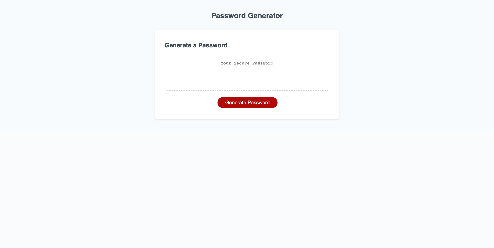

# password-generator-5000

## Description

- This is an application that enables users to generate random passwords based on criteria that they’ve selected. This app runs in the browser and features dynamically updated HTML and CSS powered by JavaScript code.

- When a user geings with a click, they are presented with a series of prompts for password criteria including multiple different character types, and length options.

[Click here to try the Password Generator!](https://shaneconwell.github.io/password-generator-5000/)

